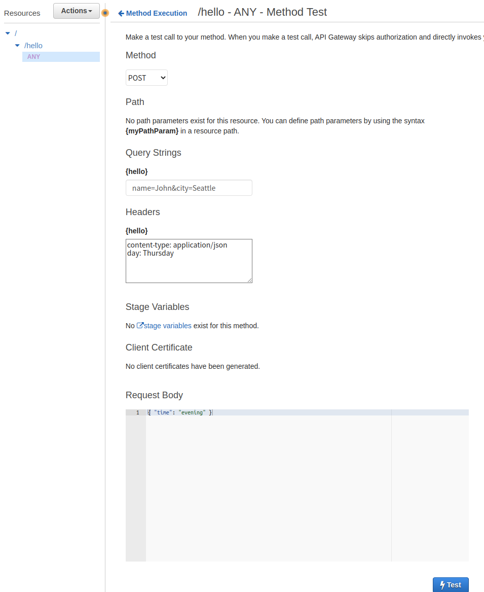
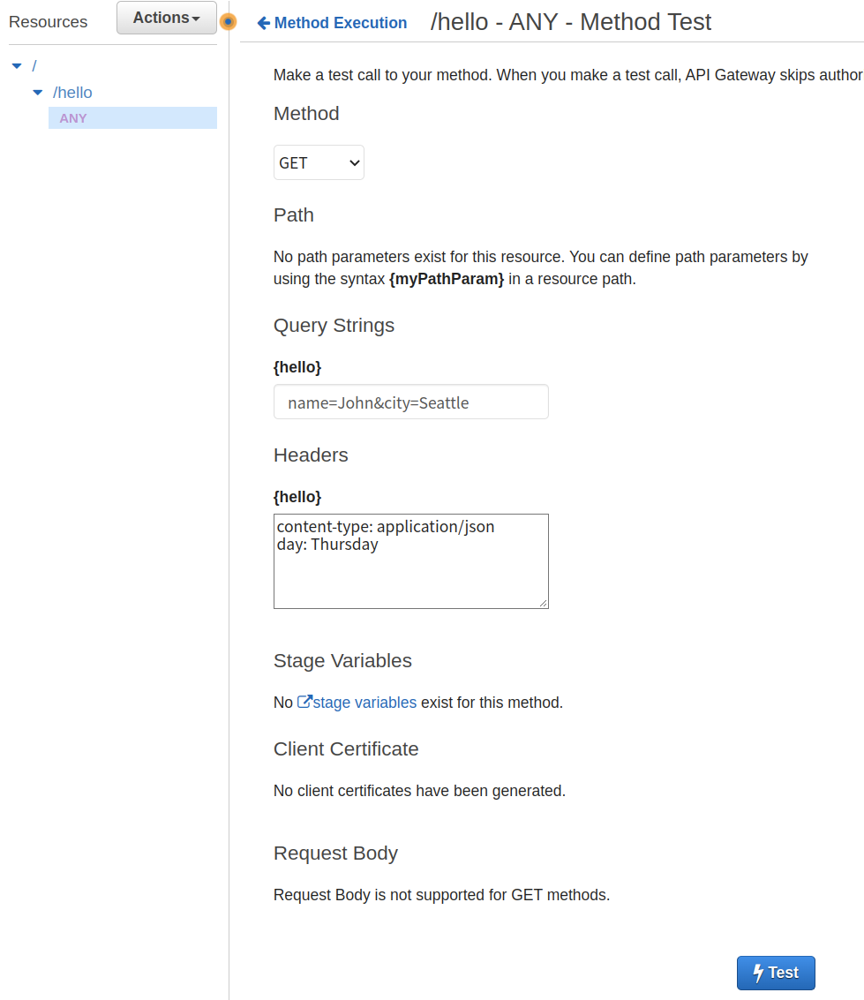

# Build an API Gateway REST API with Lambda integration - Proxy

[Tutorial: Build a Hello World REST API with Lambda proxy integration](https://docs.aws.amazon.com/ko_kr/apigateway/latest/developerguide/api-gateway-create-api-as-simple-proxy-for-lambda.html)를 pulumi로 구현합니다.

**Lambda proxy integration**에서는 lambda 함수에 대한 input을 equest headers / path variables / query string parameters / body를 조합하여 사용합니다.


## Test



- Request: `/hello?name=John&city=Seattle`
Status: 200
- Latency: 73 ms
- Response Body
    ```json
    {
        "message": "Good evening, John of Seattle. Happy  Thursday!",
        "input": {
            "resource": "/hello",
            "path": "/hello",
            "httpMethod": "POST",
            "headers": {
                "content-type": " application/json",
                "day": " Thursday"
            },
            "multiValueHeaders": {
                "content-type": [
                    " application/json"
            ],
            "day": [
                " Thursday"
            ]
            },
            "queryStringParameters": {
                "city": "Seattle",
                "name": "John"
            },
            "multiValueQueryStringParameters": {
            "city": [
                "Seattle"
            ],
            "name": [
                "John"
            ]
            },
            "pathParameters": null,
            "stageVariables": null,
            "requestContext": {
            "resourceId": "f3cpcm",
            "resourcePath": "/hello",
            "httpMethod": "POST",
            ...
            "body": "{ \"time\": \"evening\" }",
            "isBase64Encoded": false
        }
    }
    ```
 

- Request: `/hello?name=John&city=Seattle`
- Status: 200
- Latency: 20 ms
- Response Body
    ```json
    {
        "message": "Good evening, John of Seattle. Happy  Thursday!",
        "input": {
            "resource": "/hello",
            "path": "/hello",
            "httpMethod": "GET",
            "headers": {
                "content-type": " application/json",
                "day": " Thursday"
            },
            "multiValueHeaders": {
            "content-type": [
                " application/json"
            ],
            "day": [
                " Thursday"
            ]
            },
            "queryStringParameters": {
            "city": "Seattle",
            "name": "John"
            },
            "multiValueQueryStringParameters": {
            "city": [
                "Seattle"
            ],
            "name": [
                "John"
            ]
            },
            "pathParameters": null,
            "stageVariables": null,
            "requestContext": {
            "resourceId": "f3cpcm",
            "resourcePath": "/hello",
            "httpMethod": "GET",
            ...
            "body": "{ \"time\": \"evening\" }",
            "isBase64Encoded": false
        }
    }
    ```